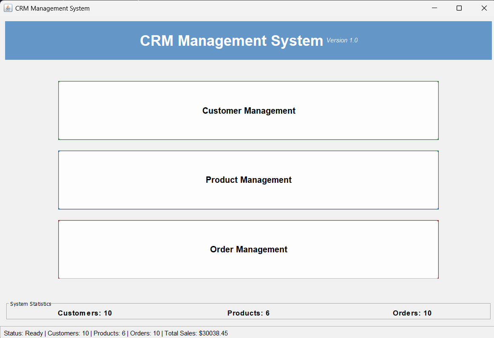
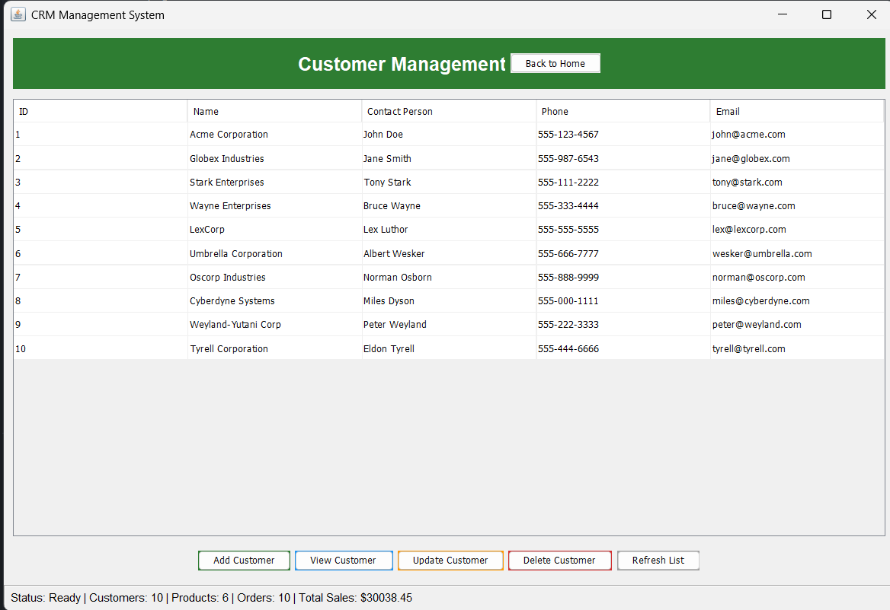
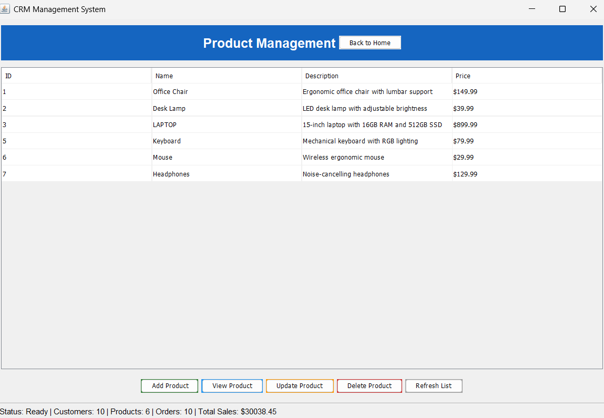
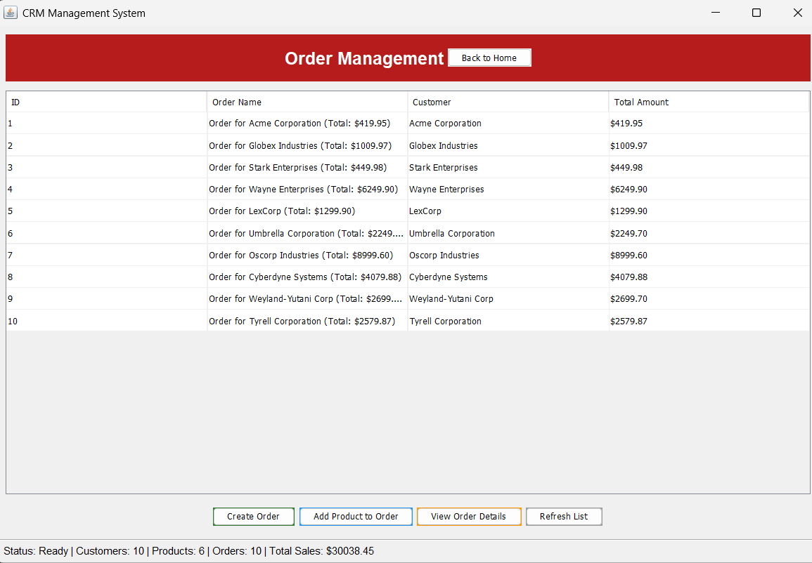

# CRM Management System

A robust Customer Relationship Management (CRM) system implemented in Java with a clean, intuitive graphical user interface. This application allows businesses to efficiently manage customers, products, and orders with full data persistence.



## 🌟 Key Features

- **Customer Management:**
  - Create, view, update, and delete customer records
  - Track contact information and history
  - Intuitive sorting and filtering options

- **Product Management:**
  - Manage product catalog with detailed information
  - Set and update pricing
  - Track product performance

- **Order Management:**
  - Create orders tied to specific customers
  - Add multiple products to each order with quantity tracking
  - Calculate order totals automatically
  - View comprehensive order details

- **Data Visualization:**
  - Live statistics dashboard on home screen
  - Real-time updates of key metrics

- **Data Persistence:**
  - Automatic saving of all data changes
  - Data recovery on application restart
  - No database configuration required

## 📋 System Requirements

- **Java Development Kit (JDK)** 15 or newer
- **Windows, macOS, or Linux** operating system
- Minimum 4GB RAM recommended
- 100MB free disk space

## ⚙️ Installation Instructions

### Method 1: Binary Installation

1. **Download the latest release**
2. **Extract the ZIP file** to a directory of your choice
3. **Navigate to the installation directory**

### Method 2: Build from Source

1. **Clone the repository:**
   ```
   git clone https://github.com/Manas0624/Java-project.git
   cd crm-management-system
   ```

2. **Compile the source code:**
   ```
   mkdir -p bin
   javac -d bin src/com/example/crm/*.java
   ```

## 🚀 Running the Application

### GUI Mode (Recommended)

**Windows:**
- Double-click the `run-crm-gui.bat` file, or
- Open command prompt and run:
  ```
  .\run-crm-gui.bat
  ```

**macOS/Linux:**
- Open terminal and run:
  ```
  ./run-crm-gui.sh
  ```

### Console Mode (Advanced Users)

**Windows:**
- Double-click the `run-crm-console.bat` file, or
- Open command prompt and run:
  ```
  .\run-crm-console.bat
  ```

**macOS/Linux:**
- Open terminal and run:
  ```
  ./run-crm-console.sh
  ```

### IDE (Development)

1. Open the project in Visual Studio Code with Java extensions installed
2. Run the `MainApp.java` file for GUI mode or `CRMApp.java` for console mode

## 📂 Project Structure

```
crm-management-system/
├── bin/                    # Compiled class files
├── data/                   # Data storage directory
│   ├── customers.dat       # Customer data
│   ├── products.dat        # Product data
│   └── orders.dat          # Order data
├── docs/                   # Documentation
│   └── images/             # Screenshots and images
├── lib/                    # External libraries
├── src/                    # Source code
│   └── com/
│       └── example/
│           └── crm/
│               ├── Customer.java          # Customer entity
│               ├── CustomerService.java   # Customer business logic
│               ├── CRMApp.java            # Console application entry point
│               ├── CRMGui.java            # GUI implementation
│               ├── DataStorage.java       # Data persistence
│               ├── MainApp.java           # GUI application entry point
│               ├── Order.java             # Order entity
│               ├── OrderItem.java         # Order item entity
│               ├── OrderService.java      # Order business logic
│               ├── Product.java           # Product entity
│               └── ProductService.java    # Product business logic
├── .gitignore              # Git ignore file
├── clear-data.bat          # Reset data script (Windows)
├── LICENSE                 # License file
├── README.md               # This file
├── run-crm-console.bat     # Run console app script (Windows)
├── run-crm-full.bat        # Compile and run GUI app script (Windows)
└── run-crm-gui.bat         # Run GUI app script (Windows)
```

## 🖥️ User Interface Guide

The application features a modern and accessible interface with dark text on colored backgrounds for better readability and contrast. The UI is designed to be intuitive and user-friendly.

### Home Screen
The home screen provides quick access to all major functions and displays key statistics including:
- Total number of customers
- Total number of products
- Total number of orders
- Total sales value

### Customer Management
- **Adding Customers:** Click "Add Customer" and fill in the required fields
- **Viewing Customers:** Select a customer and click "View Customer"
- **Updating Customers:** Select a customer and click "Update Customer"
- **Deleting Customers:** Select a customer and click "Delete Customer"

### Product Management
- **Adding Products:** Click "Add Product" and fill in the required fields
- **Viewing Products:** Select a product and click "View Product"
- **Updating Products:** Select a product and click "Update Product"
- **Deleting Products:** Select a product and click "Delete Product"

### Order Management
- **Creating Orders:** Click "Create Order" and select a customer
- **Adding Products to Orders:** Select an order, click "Add Product to Order", choose a product and specify quantity
- **Viewing Order Details:** Select an order and click "View Order Details"

## 💾 Data Management

All data is automatically saved in the `data/` directory in the following files:
- `customers.dat`: Customer information
- `products.dat`: Product catalog
- `orders.dat`: Order records

To reset all data, run the `clear-data.bat` (Windows) script and restart the application.

## 🛠️ Troubleshooting

### Common Issues:

1. **Application won't start:**
   - Verify Java is installed correctly: `java -version`
   - Ensure you have the correct JDK version (15+)

2. **Error loading data:**
   - Check the `data/` directory exists and is writable
   - If data files are corrupted, run `clear-data.bat` to reset

3. **Display issues:**
   - Ensure your system meets the minimum requirements
   - Try adjusting your screen resolution

## 🤝 Contributing

Contributions are welcome! Please feel free to submit a Pull Request.

1. Fork the repository
2. Create your feature branch: `git checkout -b feature/amazing-feature`
3. Commit your changes: `git commit -m 'Add some amazing feature'`
4. Push to the branch: `git push origin feature/amazing-feature`
5. Open a Pull Request

## 📜 License

This project is licensed under the MIT License - see the LICENSE file for details.

## 📧 Contact

For questions or support, please contact: yourname@example.com

## 📸 Screenshots

### Home Screen Dashboard

*The main dashboard showing key statistics and navigation options.*

### Customer Management

*Customer management interface with options to add, view, edit and delete customers.*

### Product Management

*Product catalog management with pricing information.*

### Order Management

*Creating and managing orders with product selection.*

---

**Made with ❤️ by Your Name/Team**